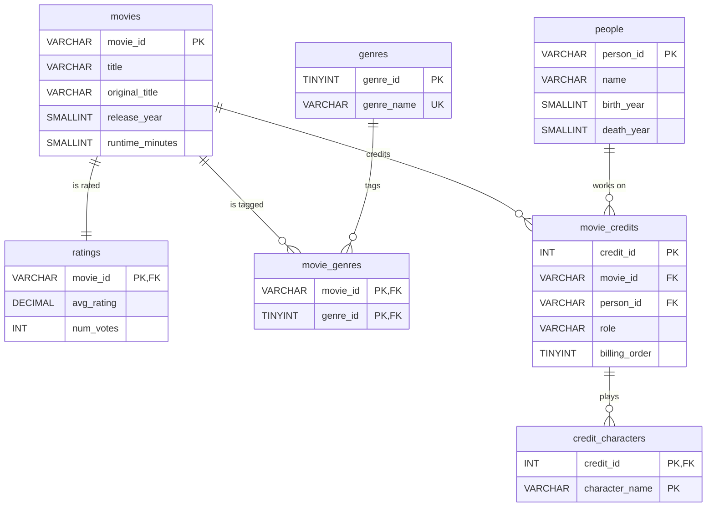

# ER Diagram: `imdb_movies`

GitHub renders this diagram automatically. `PK` = primary key, `FK` = foreign key, `UK` = unique.

## How to read it

| Relationship | Meaning |
|---|---|
| `movies` → `ratings` (one-to-one) | Every film has exactly one rating row |
| `movies` ↔ `genres` via `movie_genres` (many-to-many) | A film can have several genres; a genre covers many films |
| `movies` ↔ `people` via `movie_credits` (many-to-many) | A film has many people; a person works on many films, in one or more roles |
| `movie_credits` → `credit_characters` (one-to-many) | An acting credit can include several characters (one actor, multiple roles in the same film) |

## Why it's designed this way

- **No lists inside a column.** The raw data stores genres as `"Action,Comedy,Drama"`. Splitting them into `movie_genres` means "all Comedy films" is a simple, fast join instead of a slow text search.
- **One `movie_credits` table for every role.** Actors, directors, and writers share one table with a `role` column, so questions like "which actor–director pairs work together most" are a self-join on the same table.
- **Characters get their own table.** Profiling the data showed 11,200 cases of one actor playing several characters in the same film (e.g. Giuseppe de Liguoro plays three roles in *Dante's Inferno*, 1911). A single `character_name` column would have lost all but one, so characters live in `credit_characters`.
- **Constraints enforce quality.** Foreign keys stop credits pointing at people who don't exist; CHECK constraints reject impossible values like a rating of 12 or a negative runtime.
